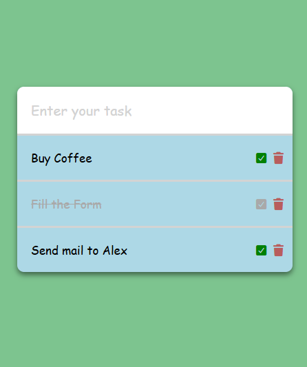

# To Do List Problem

## Description
This project is a simple to do list built using HTML, CSS, and JavaScript. You can add the tasks, delete them. You can see the tasks even after refreshing the page.

## Technologies Used
- HTML
- CSS
- JavaScript

## How to Run
1. Download or clone the repo.
2. Open the `index.html` file in your browser.
3. Enjoy!

## Screenshot

